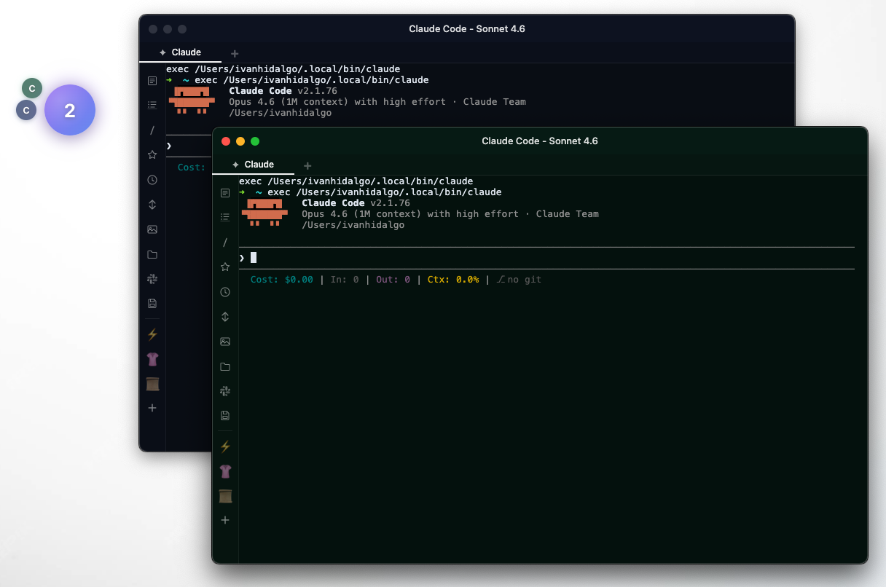
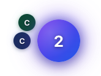
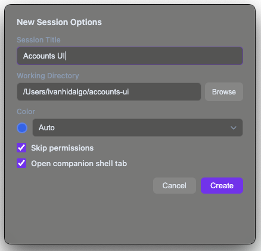
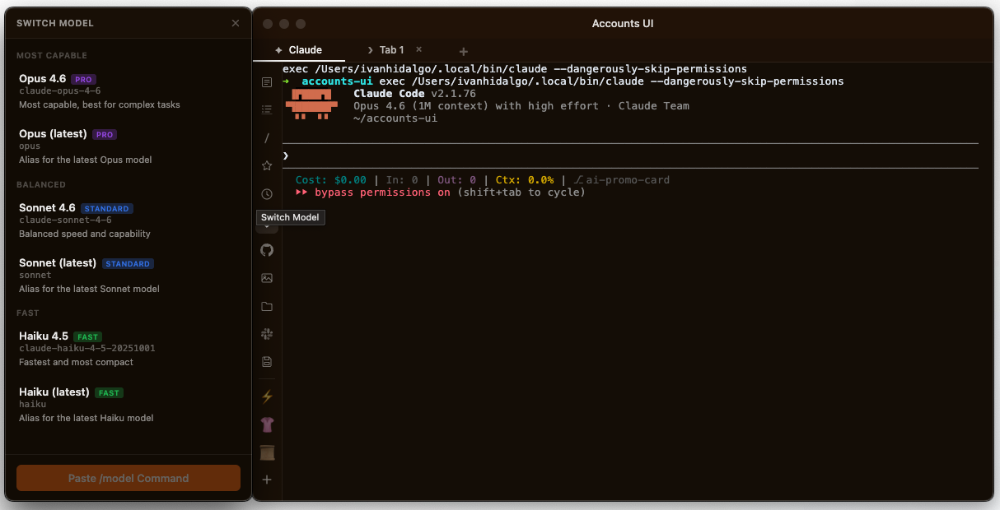
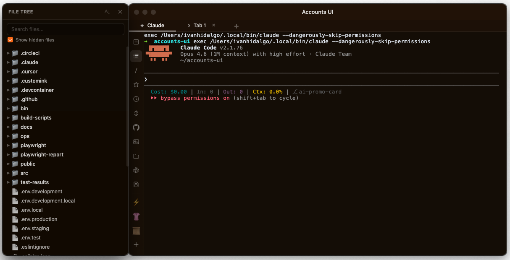
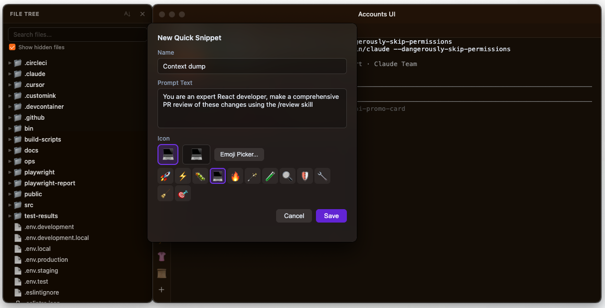

# Carapace

Visual menu-bar app for managing Claude Code sessions. Built with Electron + React + xterm.js.


<p align="center">
  
</p>

<p align="center">
  
</p>

<p align="center">
  
  
</p>

<p align="center">
  
  
</p>

## Features

### Floating Orb
- Always-on-top transparent floating orb showing active session count
- Session pills arc around the right side of the orb with name, context %, and thinking spinner
- Click the orb to create a session (or trigger a configured action); right-click for quick actions
- Click a pill to instantly focus that terminal; right-click for rename, emoji, color, preset, close
- Pulsing bell indicator on pills when Claude finishes responding in an unfocused window
- Thinking spinner on pills when Claude is actively responding
- Draggable to any screen edge — can now sit flush with the right side of the screen

### Session Management
- Spawn new Claude Code sessions with custom title, folder, color, and model
- 8-color palette for visually distinguishing sessions
- Skip-permissions mode for trusted sessions
- Session discovery automatically detects running Claude processes
- Revive recent sessions with preserved color, label, emoji, bypass mode, and prompt history
- Real-time session metrics: token usage, cost, context window percentage, duration

### Terminal Windows
- Full terminal emulation powered by xterm.js + node-pty
- Colored titlebar and background tint matching session color
- Dynamic window titles showing session name and active model
- Multiple shell tabs — click "+" to add new shell tabs alongside Claude
- Right-click tab titles to rename them; names persist across session revival
- Drag-and-drop files/folders into the terminal to insert paths
- Clickable links open in your default browser
- Right-click context menu (Copy, Paste, Select All, Clear Terminal)
- Cmd+K to clear terminal
- Clipboard image paste support

### Attention Bell
- Audible notification (Glass.aiff) when Claude finishes responding in an unfocused terminal
- Bell arms on user input and fires after output stops
- Configurable chime sound and volume
- Visual indicator on session pill (pulsing bell emoji)
- Auto-clears when you focus the terminal window
- 30s polling fallback catches any notifications missed by the hook system

### Event-Driven Session Monitoring
- Claude Code `Stop` and `PreToolUse` hooks post callbacks to a local server (port 7799) for instant bell/spinner updates
- Replaces CPU-intensive 5s polling loops with zero-latency hook callbacks
- Precise scheduler timing fires at the exact minute boundary instead of drifting with 60s intervals
- Generation-counter timer pattern eliminates timer-handle leaks for thinking spinners
- Trust dialog pre-accepted automatically for scheduled sessions — no fragile PTY scanning

### Stacks
- Named tech-stack configurations that group a working directory and related project paths
- Launch a stack directly from the orb context menu — opens a session at the stack's root and adds all project paths to Claude's context via `--add-dir`
- Per-project launches from the context menu: jump straight to an individual project within a stack
- Stacks sidebar drawer: view, create, edit, and delete stacks; launch individual projects or the full stack
- Import stacks from another Carapace user via JSON export — path-verification dialog lets you remap any paths that don't exist on your machine before importing
- Share a stack by exporting it as a JSON file
- Storage format is one YAML file per stack in `~/.claude/stacks/`, compatible with the `/stacks` Claude Code plugin
- Bind a preset to a stack so launching the preset always uses the stack's current working directory
- Per-stack **Skip Permissions** flag — mark a stack to always launch with `--dangerously-skip-permissions`

### Daily Token Gauge
- Round fuel-gauge dial below the orb tracking today's total token consumption across all sessions
- Gradient arc from red (left / at limit) to green (right / full budget remaining); needle sweeps from green toward red as tokens are consumed
- Set a max daily token goal in Settings → **Max Daily Tokens** (0 hides the gauge)
- Updates in real-time as JSONL transcripts change — no manual refresh needed
- Hover the gauge for a glow effect; tooltip shows tokens used and daily goal

### Session Usage Gauge
- Second concentric arc gauge (outer ring) visualizing today's usage breakdown across sessions and models
- Colored segments match each session's orb color — instantly see which sessions consumed the most tokens
- Flat segment joints with rounded outer tips for a clean, polished arc appearance
- Four display modes cycled by the mode button below the gauge:
  - **Tokens / Session** — token consumption per individual session (person + bolt icon)
  - **Cost / Session** — dollar cost per session (person + $ icon)
  - **Tokens / Model** — token consumption grouped by model version: Sonnet 4.6, Opus 4.7, Haiku 4.5, etc. (chip + bolt icon)
  - **Cost / Model** — cost grouped by model version (chip + $ icon)
- Tracks all sessions started today even after they are closed — backed by the same persistent daily-token store as the budget gauge
- Session names resolved in priority order: preset/stack title → session title → folder name
- Session colors matched to the orb color assigned when the session was launched
- Cost and model data for each session enriched from JSONL transcripts at query time
- Hover a segment to highlight it and show a tooltip with the session name and metric value
- Mode button shows a fused icon representing the current mode; hovering shows a tooltip label below

### Sidebar Tools
- **Notes** — Floating notepad per session
- **Slash Commands** — Quick access to built-in Claude commands
- **Skills Browser** — Browse and use user/plugin skills
- **File Tree** — Navigable directory tree of the session's working folder with right-click "Add to prompt"
- **Stacks** — Browse and launch named tech-stack configurations
- **Image Gallery** — Global image collection with drag-drop import, paste, thumbnails, and right-click context menu (copy, reveal in Finder, remove)
- **Open Folder** — Open session directory in Finder
- **Model Selector** — Drawer panel to switch Claude models
- **GitHub** — Open the session's Git repo in your browser
- **Prompt History** — Last 20 prompts with one-click re-use, persisted across session revival
- **Share to Slack** — Compose and send session context to Slack
- **Custom Snippets** — Create, edit, and manage quick-paste prompt snippets with custom emoji icons
- Drag-and-drop sidebar icons to reorder; right-click sidebar background to toggle icon visibility
- Sidebar order and visibility persist across all sessions

### Session Panel
- Vibrancy popover showing all active sessions
- Session cards with live metrics (tokens, cost, context %, duration)
- Context bar visualization
- Quick actions: focus, close, or manage sessions

## Install (Pre-built App)

Download the latest `.dmg` from [Releases](https://github.com/customink/Carapace/releases), open it, and drag Carapace to Applications.

**Important — macOS Gatekeeper:** The app is not code-signed. After installing, run this once in Terminal:

```bash
xattr -cr /Applications/Carapace.app
```

Then open Carapace normally. Without this step, macOS will show "Carapace is damaged" and refuse to open it.

**Requires:** [Claude Code CLI](https://docs.anthropic.com/en/docs/claude-code) installed (`npm i -g @anthropic-ai/claude-code`)

## Build from Source

```bash
./install.sh         # check prerequisites, install deps, build
npx electron out/main/index.js  # run the app
```

Or manually:

```bash
npm install          # also runs electron-rebuild for node-pty
npm run build        # production build to /out
npx electron out/main/index.js  # run production build
npm run dev          # dev mode with hot reload
npm run dist         # build .dmg + .zip installer
```

## Dependencies

### Runtime

| Package | Description |
|---------|-------------|
| [electron](https://www.electronjs.org/) | Desktop app framework (Chromium + Node.js) |
| [node-pty](https://github.com/nickvdp/node-pty) | Native pseudoterminal bindings for spawning shell/CLI processes |
| [@xterm/xterm](https://xtermjs.org/) | Terminal emulator UI component |
| [@xterm/addon-fit](https://www.npmjs.com/package/@xterm/addon-fit) | Auto-fit terminal to container dimensions |
| [@xterm/addon-web-links](https://www.npmjs.com/package/@xterm/addon-web-links) | Clickable URL detection in terminal output |
| [react](https://react.dev/) | UI component library |
| [react-dom](https://react.dev/) | React DOM renderer |
| [framer-motion](https://www.framer.com/motion/) | Animation library for orb/mini-orb transitions |
| [chokidar](https://github.com/paulmillr/chokidar) | File system watcher for JSONL transcript changes |
| [date-fns](https://date-fns.org/) | Date utility functions |
| [zustand](https://zustand-demo.pmnd.rs/) | Lightweight state management |

### Development

| Package | Description |
|---------|-------------|
| [electron-vite](https://electron-vite.org/) | Vite-based build tooling for Electron apps |
| [vite](https://vitejs.dev/) | Frontend build tool and dev server |
| [@vitejs/plugin-react](https://www.npmjs.com/package/@vitejs/plugin-react) | React Fast Refresh and JSX transform for Vite |
| [typescript](https://www.typescriptlang.org/) | Static type checking |
| [tailwindcss](https://tailwindcss.com/) | Utility-first CSS framework |
| [@tailwindcss/vite](https://www.npmjs.com/package/@tailwindcss/vite) | Tailwind CSS integration for Vite |
| [@types/node](https://www.npmjs.com/package/@types/node) | TypeScript type definitions for Node.js |
| [@types/react](https://www.npmjs.com/package/@types/react) | TypeScript type definitions for React |
| [@types/react-dom](https://www.npmjs.com/package/@types/react-dom) | TypeScript type definitions for React DOM |
| [@electron/rebuild](https://github.com/nickvdp/electron-rebuild) | Rebuilds native Node modules (node-pty) for Electron's Node version |

## Architecture

Three Electron contexts connected via IPC:

```
Main Process (Node.js)          Preload (bridge)        Renderer (React)
├── index.ts (app entry)        ├── index.ts            ├── App.tsx
├── windows/                    └── terminal.ts         ├── components/
│   ├── orb.ts (floating orb)                           │   └── orb/FloatingOrb.tsx
│   ├── terminal.ts (per-session)                       ├── hooks/useSessions.ts
│   ├── prompt.ts (options dialog)                      ├── terminal-main.ts (xterm.js)
│   ├── snippet-dialog.ts                               └── styles/globals.css
│   ├── settings.ts
│   ├── model-selector.ts
│   ├── file-tree.ts
│   ├── prompt-history.ts
│   ├── image-gallery.ts
│   ├── drawer-base.ts
│   └── slack-compose.ts
├── services/
│   ├── pty-manager.ts
│   ├── session-spawner.ts
│   ├── session-discovery.ts
│   ├── process-detector.ts
│   ├── session-monitor.ts
│   ├── terminal-focus.ts
│   ├── cost-calculator.ts
│   ├── context-tracker.ts
│   ├── jsonl-parser.ts
│   ├── settings-reader.ts
│   ├── usage-fetcher.ts
│   ├── snippet-store.ts
│   ├── prompt-history.ts
│   └── app-settings-store.ts
├── ipc/
│   ├── channels.ts
│   └── handlers.ts
└── shared/
    ├── types/session.ts, snippet.ts
    ├── constants/colors.ts, pricing.ts, paths.ts, snippet-icons.ts
    └── utils/format.ts
```

## License

MIT
